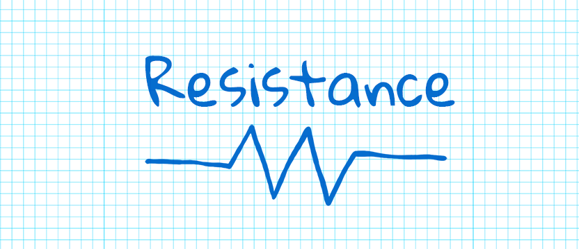

<p align="center">
    
</p>

<p align="center">
    
    <a href="https://swift.org/package-manager">
        
    </a>
     
</p>

**Resistance** is a Swift library for creating and manipulating resistors and their values. It was designed to be easy to use whilst still providing plenty of features including:

- Easy to use API for creating resistors
- E-Series standards functionality
- Tolerance and temperature coefficient calculations
- Swift Playground full of example code

## Usage
### Creating a resistor
The most basic, and likely the thing you'll want to do most often, is to create a resistor. A Resistor is represented using an enum with associated values for the digit, multiplier and tolerance bands, themselves represented by enums. The following demonstrates how simple it is to create a new resistor variable.
```swift
let fourBand = Resistor.fourBand(.brown, .black, .red, .gold)
let fiveBand = Resistor.fiveBand(.yellow, .violet, .black, .red, .gold)
let sixBand = Resistor.sixBand(.blue, .grey, .black, .black, .gold, .brown)
```

### Resistor Properties
The Resistor type is implemented using an enum with associated values for the digit, multiplier and tolerance rating. These associated values can be pulled out in the usual way with a switch statement, but  it's much easier to use the built in properties to do so.
```swift
let fourBand = Resistor.fourBand(.green, .blue, .red, .gold)

let resistanceValue = fourBand.value        // 5600
let digitBands = fourBand.digits            // [green, blue]
let multiplierBand = fourBand.multiplier    // red
let toleranceBand = fourBand.tolerance      // gold
```

## Installing


## Requirements
* Swift 5.3

## License
Resistance is released under the MIT license. See LICENCE for details.
