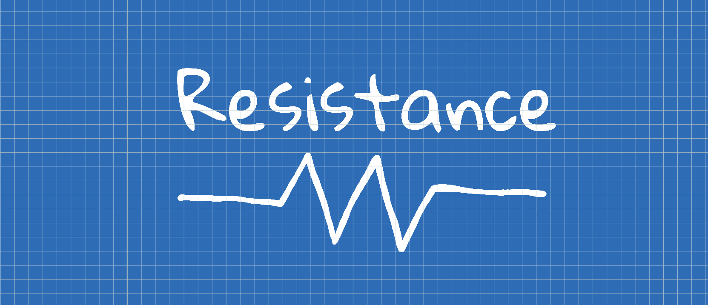

<p align="center">
    
</p>

<p align="center">
    
    <a href="https://swift.org/package-manager">
        
    </a>
     
</p>

**Resistance** is a Swift library for creating and manipulating resistors and their values. It was designed to be easy to use
whilst still providing plenty of features including:

- Easy to use API
- Support for four, five, and six band resistors
- E-Series standards functionality
- Tolerance and temperature coefficient calculations
- Swift Playground documentation

## Usage
### Creating a Resistor
The most basic, and likely the thing you'll want to do most often, is to create a resistor. A `Resistor` is represented using an
enum with associated values for the digit, multiplier and tolerance bands, themselves represented by enums. The following 
demonstrates how simple it is to create a new resistor variable.
```swift
let fourBand = Resistor.fourBand(.brown, .black, .red, .gold)
let fiveBand = Resistor.fiveBand(.yellow, .violet, .black, .red, .gold)
let sixBand = Resistor.sixBand(.blue, .grey, .black, .black, .gold, .brown)
```

### Resistor Properties
The `Resistor` type is implemented using an enum with associated values for the `digit`, `multiplier` , `tolerance` rating, 
and `coefficient` rating. These associated values can be pulled out in the usual way with a switch statement, but it's much 
easier to use the built in properties to do so.
```swift
let fourBand = Resistor.fourBand(.green, .blue, .red, .gold)

let resistanceValue = fourBand.value            // 5600
print(fourBand.digits)                          // [green, blue]
print(fourBand.multiplier)                      // red
print(fourBand.tolerance)                       // gold

let sixBand = Resistor.sixBand(.blue, .grey, .black, .black, .gold, .brown)
print(sixBand.coefficient!)                     // brown

print(fourBand.digits.map(\.rawValue))          // [5.0, 6.0]
print(fourBand.multiplier.rawValue)             // 100.0
print(fourBand.tolerance.rawValue)              // 0.05
print(sixBand.coefficient!.rawValue)            // 100.0
```
### Calculating Tolerance and Temperature Coefficient Ranges
The `Resistor` type also contains two members for working out common resistance calculations. Both return a `Range<Double>` 
meaning you can make use of all the functions `Range` provides.
```swift
let fourBand = Resistor.fourBand(.brown, .black, .orange, .gold)
let sixBand = Resistor.sixBand(.yellow, .violet, .black, .brown, .gold, .brown)

let toleranceValueRange = fourBand.toleranceValueRange
print(toleranceValueRange.upperBound)           // 10500.0
print(toleranceValueRange.lowerBound)           // 9500.0

let coefficientValueRange = sixBand.coefficientValueRange(tempChange: 5)
print(coefficientValueRange.upperBound)         // 4702.35
print(coefficientValueRange.lowerBound)         // 4697.65
```

### Turning a Value into a Resistor
Sometimes you'll want to create a `Resistor` from a value rather than coloured bands.
When this is the case, you're going to want to use `ResistorFactory`.

Because not all values can be represented by the bands of a resistor, when using `ResistorFactory`, you have the choice to either, round the value, or throw an error, if such a value is encountered.
```swift
let factory = ResistorFactory()

let roundedUpFourBand = factory.makeFourBand(value: 456, tolerance: .silver)
let sixBand = factory.makeSixBand(value: 454, tolerance: .silver, coefficient: .yellow)

print(roundedUpFourBand)                        // 460 Ω
print(sixBand)                                  // 450 Ω

do {
    let failedFiveBand = try factory.makeFiveBandOrFail(value: 1234, tolerance: .silver)
} catch {
    print(error)                                // invalidValueError
}
```

### Converting Resistors


### E-Series functionality

## Swift Playground Documentation
`Resistance` includes a Swift Playground file with detailed instructions and runnable example code 
to make it easy to learn. 

## Installing
`Resistance` is distributed using the [Swift Package Manager](https://swift.org/package-manager/). To import it using Xcode, follow 
this [guide](https://developer.apple.com/documentation/xcode/adding_package_dependencies_to_your_app).
Or add it as a dependency within your Package.swift manifest:
```swift
let package = Package(
    ...
    dependencies: [
        .package(url: "https://github.com/8rightside/resistance.git", from: "1.0.0")
    ],
    targets: [
        .target( name: "YourTarget", dependencies: ["Resistance"]),
    ]
    ...
)
```
Don't forget to import it where needed.
```swift
import Resistance
```

## Requirements
* Swift 5.3

## License
Resistance is released under the MIT license. See LICENCE for details.
